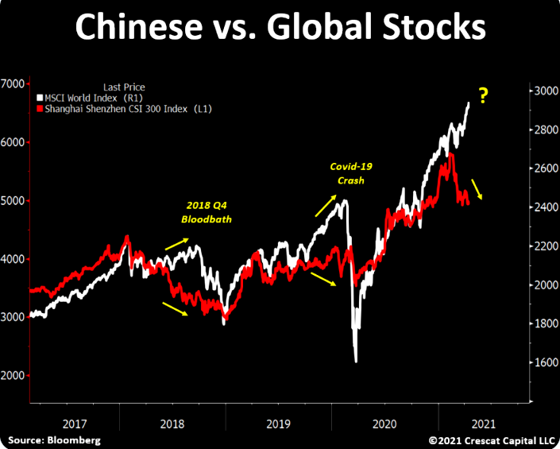
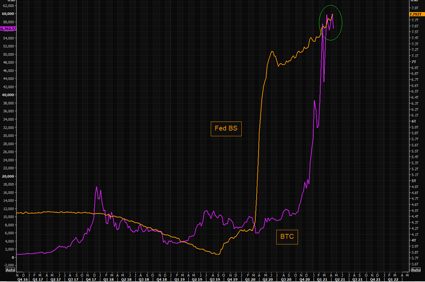

# The day

## Bear baiting

The latest Bear Cave letter is out. 
https://thebearcave.substack.com/p/the-bear-cave-62

I strongly suggest you [sign up](https://thebearcave.substack.com/).

I've extracted some of the tips.

### NYSE:QS

Fantasy battery technology. Another Theranos, this time for batteries.

### NASDAQ:NTGR

Netgear, home hi-fi hardware, eroding sales, tired product.

### NASDAQ:EQOS

Diginex: another crypto exchange Ponzi. HK based, which increases risk.

### NASDAQ:LFMD

LifeMD. Telehealth co. which uses unregistered doctors to dispense OTC medications. 

### Takeover arbitrage

Koneko Research published a report titled “Long SOHU Short SOGO” Koneko argued,

    “The current market price of SOGO implies a high likelihood that its $9/ADS acquisition by Tencent will be successful while the current market price of SOHU implies a very significant likelihood of failure. A hedged position has a high probability, but not a guarantee, of an attractive return regardless of the deal outcome.”
    
Tricky to implement, imho.

### NASDAQ:RIOT

Another crypto Ponzi.

## Einhorn and the Arch Egos

[Someone picked up on the fact that Bill Hwang was pumping $GSX](https://markets.businessinsider.com/news/stocks/david-einhorn-investor-letter-archegos-gsxtechedu-stock-trading-real-story-2021-4-1030314247) and that this is straightforward stock market manipulation, which the SEC should do something about. Except we know it turns a blind eye to any activity that lifts the price of Ponzi stocks.

## Chinese puzzle

There are a lot of very overvalued Chinese stocks. 
There have always been a lot of very overvalued Chinese stocks. 
The question is: why is the market behaving differently now?
From TME.

## Bitcoin represents freedom from the Fed

… on the other hand, maybe not.

