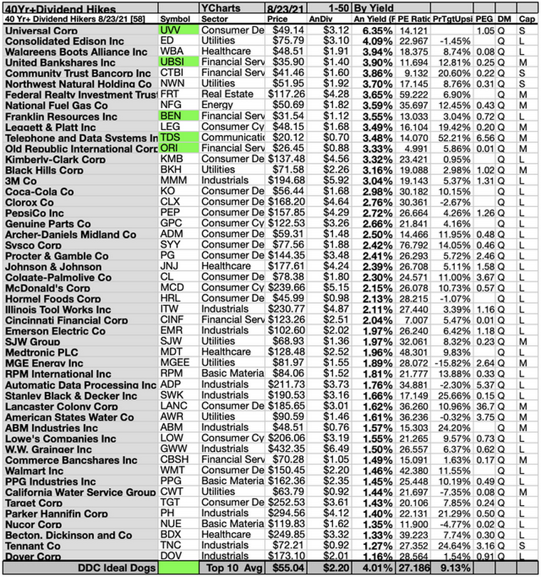

# 25 Aug 2021

## Bill Nelson

> There was an old lady who swallowed a fly;
> 
> I don't know why she swallowed a fly - Perhaps she'll die!
> 
> There was an old lady who swallowed a spider  
> That wriggled and jiggled and tickled inside her!
> 
> She swallowed the spider to catch the fly;
> 
> I don't know why she swallowed a fly - Perhaps she'll die!
> 
> There was an old lady who swallowed a bird;  
> How absurd to swallow a bird!
> 
> She swallowed the bird to catch the spider  
> That wriggled and jiggled and tickled inside her!
> 
> She swallowed the spider to catch the fly;
> 
> I don't know why she swallowed a fly - Perhaps she'll die!  
> …  
> (several verses later) …  
> 
> She swallowed a horse.   
> She died, of course.

This is the inspirating for the title of a piece by Bill Nelson.
It's an academic piece, but he summarized it nicely [here](https://morningconsult.com/opinions/i-dont-know-why-she-swallowed-a-fly/).
It's saying more or less what [Rudy Havenstein](https://twitter.com/RudyHavenstein) has been saying on Twitter for a long while.
(No, it's not the real Rudy, just his reincarnation.)

Bill explains that the Fed has repeatedly tried to fix problems. The problem is that these are mainly of its own creation. 
However, each fix results in a bigger problem, which in turn requires another fix.
It's like a doctor who keeps prescribing a new, more powerful drug, to combat the side effects. 
Each new drug is required to treat the side effects of an earlier treatment.
Nelson speaks with the authority that comes with having been a senior figure at the Fed in the past.
The most egregious problem is, obviously, the balance sheet, and QE ∞. 
Nelson points out that, as in Japan, the Fed now _is_ the market for many securities, and any move it makes can create huge volatility.
The Fed itself expects that by 2023 the Fed balance sheet will be 39 percent of GDP. It was six percent before the global financial crisis. 


One can only wonder what it will be in 2033. Japan's BoJ now has a balance sheet which is several times the size of the economy.

I suspect that the Fed knowsthat it has to reverse the ridiculous stack of programs it is now running. And that it has known this for a while.
But needs to manage this without spooking the markets: a tricky operation!

I wonder if the current heavy reverse repo program is part of this process.
(Reverse repos, are when banks swap reserves for T-bills. It's a Fed program, but it's named from the point of view of the banks.)
To find out more, read [this blog by Vic Sperandeo](https://www.victorsperandeo.com/post/wall-street-newcomers-need-a-monetary-education). 
Vic does not post very often. When he does, he's worth listening to.


## Picture of the day


via [this tweet](https://twitter.com/ddoniolvalcroze/status/1426577091219181568?s=20).


## The state of the market

Chinese stocks, including $HSTECH and $KWEB are rallying. 
Maybe they've gone down enough.

Commodities going nowhere. The dip last Friday has been comprehensively bought. 
The GSCI (Goldman's commodity index) is back to where it was in early May.
Bonds pretty flat, on a week or so timeline.
The dollar is high, DX=92, but has been higher (93.55 last week), and was around this level back in March.
10Y Treasury yields are back where they were a month ago.

It's hard to make money in such a meandering market.
Jackson Hole is happening this week.
Powell may announce violent tapering, but the odds are against it.

## Dividend payers



## Pelican techie stuff

I don't suppose any of you are interested, but I recently 'upgraded' to Anaconda as a package manager for Python.
For reasons I'm a bit hazy about, when I installed Pelican via conda (just google it) I ended up with either version 3.7.0 or a screed of error messages.

Eventually, I decided to leap into the unknown and build+install the latest version from Github. 
It worked a dream. If you want to give it a go, just paste:
```
python -m pip install -e "git+https://github.com/getpelican/pelican.git#egg=pelican"
```
into a powershell. 
