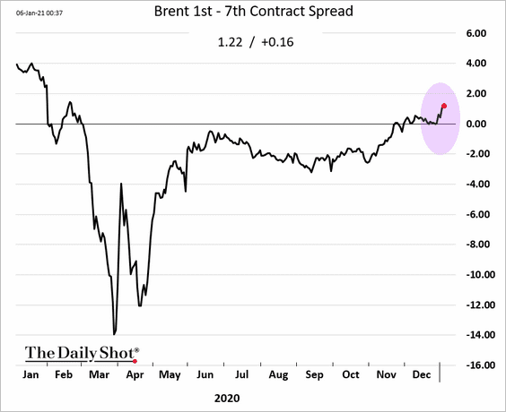

# Crumbs

- [What were we thinking?](https://thefelderreport.com/2021/01/06/what-were-you-thinking-part-tres/). Jesse Felder looks back on Scott McNeely's reflection that Sun Micro was hugely overvalued at 10 times revenue in 1999. Now 60 members of the SP500 trade at this multiple and more. The question is whether, especially if we return to growth and inflation, these multiples can be sustained,
- [The stock market goes up only outside regular trading hours](https://mobile.twitter.com/Speculator001/status/1345367407372587010). This is because all the buying is done by index funds which trade at the close. Allegedly.
- Treasuries react to Blue Wave.
- Oil futures point to future weakness: 
- [US economy is has impoverished those with poor educational outcomes](https://www.stlouisfed.org/open-vault/2020/december/has-wealth-inequality-changed-over-time-key-statistics?utm_source=twitter&utm_medium=SM&utm_content=stlouisfed&utm_campaign=fb05763f-af1f-4ec1-962d-26c5ef43f5e0), it has not discriminated by race, and certainly not gender (once allowance for worse educational performance by men has been taken into account). 
- Cannabis stocks are getting high $MJ is the ETF, up 8% yesterday,
- [Kuppy decides to get back in the pool](https://adventuresincapitalism.com/2021/01/07/everyone-back-in-the-pool/),
- 

# Wrap

Another risk on day:

- global equities up,
- all sectors, expecially tech, up,
- growth strongly outperforms value,
- commodities up,
- yields up,
- bitcoin (and the equity equivalent, $TSLA) through the roof  ...

but: 

- dollar up,
- no steepening,
- credit (high grade) flat.

Basically, a relief rally because the Trump supporter riot seems to have been closed down and Pence is going to swear in Biden.

# Random thoughts

Some technology, like nuclear power, has attracted funding for generations, without ever becoming truly economic (if you include decommissioning and spent fuel processing costs), because it's something that governments get used to spending money on. Other technology, like LED lighting, and maybe most modern screens, just get better and better, without any subsidy. But the first technology is very lucrative, for a select group of suppliers whereas the latter produces no returns above the cost of capital. 

My concern is that green energy production, whether carbon capture and storage, offshore wind farms, solar PV, lithium batteries, will ever move from the first category into the second. Clearly, these technologies are far from _hopeless_ but I am far from convinced that they will ever make the sort of progress that has characterized the second group.

Medicine seems to have examples from both groups, except the economics of pharmaceuticals is different. 
Unlike commodities, prices are not set by an auction market. 
For someone who is offered an expensive, unreliable but plausible life-saving treatment all alternative uses of resources are less attractive, almost irrespective of how unlikely the treatment is likely to be a success. 

More and more prices are set 'administratively.' Economics text books describe a world in which there is a supply schedule and a demand schedule for all sorts of heterogeneous markets. Keynes argued that give or take an adjustment factor to allow for different abilities of different men, the labour supply could be treated like the corn supply. When people like Elon Musk 'earn' billions of dollars a week, it's hard to understand how that any model in which Keynes' simplifying assumption can lead to an improved understanding of how the economy behaves. 

I am not an economist, but I did model real world things for a long time. I often made heroic assumptions, to obtain a model that assisted in thinking about the world, but this seems in a different league.

