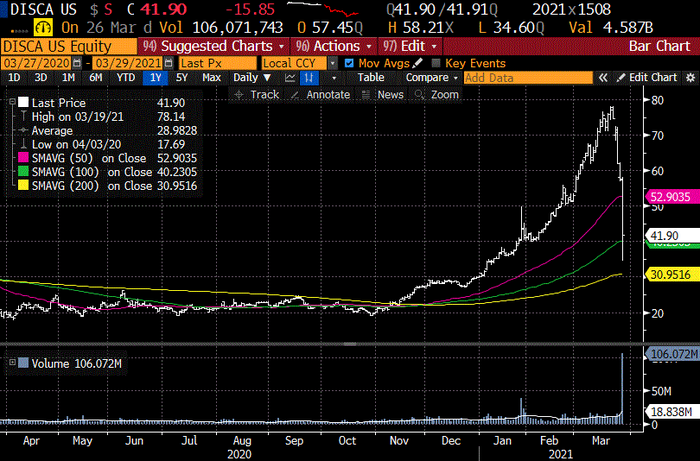

# Wrap
I stole this chart from the excellent chartpoint.com. [The forced liquidation of Archegos Capital](https://uk.finance.yahoo.com/news/archegos-capital-credit-suisse-nomura-goldman-sachs-morgan-stanley-092127768.html) over the weekend seems to have made remarkably little impression on the wider market. The leverage of that thing seems amazing, but I am prepared to put serious money (well, GBP 5) on a bet that there are plenty more where Archegos comes from.

Summary:

- equities pretty flat, DJI hits ATH, again,
- bonds slightly inflationary: 10Y Treas. now at 1.71%,
- commodities up a few pc: GSCI up 2.53%,
- DXY continues to grind higher: nearly 93 now.

# Chart

I'm always posting charts from FRED, but just to show there are no hard feelings, here is a chart from Trading Economics, which is about the UK.
The explosion of debt is not so much, but (i) the measure is highly understated because of the large unfunded pension liabilities the UK has, (ii) the steady rise of GDP makes it seem … not so bad. 100% of GDP is well above the 60% maximum permitted under the 'Growth and Stability Pact' that no longer applies now we are out of the EU. It's funny how when push comes to shove, these good intentions pave the road to hell.

<iframe src='https://d3fy651gv2fhd3.cloudfront.net/embed/?s=gbrdebt2gdp&v=202103291915V20200908&h=350&w=700' height='350' width='700'  frameborder='0' scrolling='no'></iframe> source: <a href='https://tradingeconomics.com/united-kingdom/government-debt-to-gdp'>tradingeconomics.com</a>

# Soapbox

The current state of care work in the UK is chaotic. It is the health service before 1945. A patchwork of badly paid carers offer substandard care to poor people who still can't afford it. Much personal care to individuals who have age-related conditions which, should they be experienced by younger individuals, would be counted as medical conditions (and thus due medical care). Labelling doesn't matter, except it makes a big difference to who picks up the tab. Care for people with a medical condition is free. The support for this policy in the UK is practically a national religion. Care for the elderly, frail and infirm is very expensive indeed.

Rather than spend time having sterile debates about whether or not people have to give up their house to pay for this care (as against give up their portfolio of income generating securities they bought with the proceeds of the sale of their house), we should just put the two systems on the same basis. Of course, this will mean bureaucracy, inefficiency, and explosion of a management class, slow decision making. But we have that already in the NHS, and we seem, collectively, to think that these things are a price worth paying.
