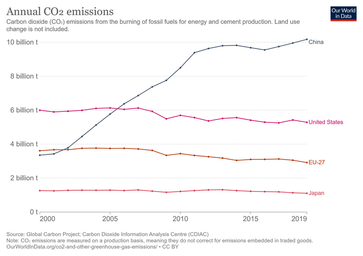

# 7 Sept 2021

## It's probably a really bad time to buy a house in the UK
<iframe id="reddit-embed" src="https://www.redditmedia.com/r/dataisbeautiful/comments/pf7xoz/oc_uk_real_estate_100_years_ago_was_the_time_to/?ref_source=embed&amp;ref=share&amp;embed=true" sandbox="allow-scripts allow-same-origin allow-popups" style="border: none;" scrolling="no" width="640" height="620"></iframe>

This anim shows how house prices have changed over the last couple of hundred years.
Today is an absolutely terrible time to buy, from a investment point of view.
But, this is the very time that you people are being pushed into buying like never before, 
with endless special offers on mortgages and parents convinced that house prices can never go down.

## $AMMO

[Cheap Russian ammo is being banned from being imported into the USA.](https://gundigest.com/gear-ammo/ammunition/the-end-of-an-era-the-russian-ammo-ban-and-its-consequences) Probably bullish for US ammo manufacturers. Vista Outdoor ($VSTO:NYSE), Olin Corp ($OLN:NYSE) and Ammo Inc ($POWW:PINK) seem the best bets.
[This page](https://investorplace.com/2020/09/3-ammunition-stocks-to-buy-as-gun-sales-surge/) has some rather dated background on the companies.

## Japan is back (maaaybe)

The TOPIX has had a bit of a spike lately.
Given the terrible hangover from the '92 crash (see yesterday's post), one has almost given up on the country.
However, these companies have had nearly three decades to restructure, and some at least must be clear of the awful legacy of the balance sheet recession.
However, reports of the revival of Japan have been an annual staple for a very long time.

One factor, which must be important, is BoJ buying of TOPIX ETFs. 

> The BOJ now owns ~7% of aggregate market cap in Japan, and we have a year-long lookback to evaluate their program after buying came to a screeching halt. To answer Fama’s question of how much does it take for the government to move the market: 7% in ETF inflows may have been enough in Japan. With the rest of developed world equity markets at >50% passive now, it is possible there are other, equally unpredictable and even bigger whales tails from long-term fund flow trends that can’t continue in perpetuity.

Read more [here](https://mailchi.mp/verdadcap/a-whale-of-a-tail-the-bank-of-japans-etf-hoard-part-ii?e=1ed3cf5a25).

## Wars on abstract nouns

I'm against all wars on abstract nouns. 
By their very nature, they are unwinnable. 
"Terror" or "Drugs" always win in the end. 
But they do have winners, which are the people who are paid by taxpayers for waging the war.
Increasingly, for "terror" this is arms manufacturers.
The sums are staggering.
[This article](https://theintercept.com/2021/09/01/war-on-terror-deaths-cost/?utm_medium=email&utm_source=The%20Intercept%20Newsletter) estimates that the cost has been of the order of USD 8 trillion (yes, that's $8e12 in a sensible notation).
Voters are finally waking up and saying "enough is enough."
I feel that the next war will be on infectious disease. 
I know that no government feels safe without a war to wage on *some* enemy!
Maybe it's time to rotate from Lockheed to Pfizer. 

## Degrowth is bonkers

Well, it's not so much bonkers as politically undeliverable.
[This post explains why.](https://noahpinion.substack.com/p/people-are-realizing-that-degrowth)
For a start, you'd have to get China to stall the improvements in living standards for its people (and it's global economic heft).
This is simply not going to happen, and it if doesn't happen in China, it's not going to happen in the USA.

## Big Brother is watching you, from above

[Drone surveillance really is a thing.](https://theintercept.com/2021/09/01/fbi-spy-plane-alazhari-surveillance/)

## Elmer's Spudstack is back

[Here it is.](https://elmerspud.substack.com/) It's always worth reading.
Tips recently include $HEAR (Turtle Beach) and $APRN (Blue Apron).
Blue Apron is an interesting company.

You can see why Elmer says:

> Honestly its embarrassing for any company to have an $100 million market cap in this day and age. Just put Bitcoin or Crypto or SaaS or Green Energy or EV or Battery or something in your company’s name and you’ll be worth billions. But there is one little guy that I’ve been following for a while which I like to trade in and out of - and I am getting back in it.

> APRN came onto the market as a hot IPO - well done management and underwriters - and has since withered away to nothing as the food delivery box business has proved to not be that fantastic.

## It's really hard to understand what incentives J Powell has to raise rates

[Yup, it sure is.](https://themarket.ch/english/skin-in-the-game-fomc-style-ld.4794?mc_cid=f89e2d6a75&mc_eid=8d66df2c11)

## Equity markets considered highly inelastic with respect to demand

[This paper](https://mailchi.mp/verdadcap/the-butterfly-effect) is pretty amazing, if true.
It suggests that rather than stock market prices being independent of demand, they are actually highly sensitive to them.
I remember George Soros writing that he'd given up the study of economics, because it seemed to have no bearing on the price of stocks.
I guess he was referring to microeconomics, where a commodity has a supply and a demand schedule that intersect at the observed (clearing) price.
The added complication of passive investing may explain why stock market moves have been so irrational of late.

I don't think that Elon Musk knows much about engineering, but I suspect that he understands this inelasticity effect all too well. 
Especially for stocks with a very limited free float.

## Spoofing the world

[Alex Manzara](https://www.chartpoint.com/spoofing-the-world/) is simply one of the best commentators I know.
He doesn't have substack, he doesn't pump cryptos, he is not a media person, he doesn't have a big profile,
but he writes a phenomenal post every single trading day.

His recent one (linked above) highlights the fact that Russia is getting worried about inflation, and that the Chinese are serious about redistribution.
He also points out that the NY Fed has suspended publication of their 'nowcast' model of GDP, because they don't have a clue what is happening.
Except that they are totally sure that inflation is transitory.

The other laugh is that Biden, in his chat to the kleptocrat who was previously in charge of Afghanistan, was emphasising the _perception_ that he was not actually in control of the situation. Not the reality, just the perception!

## Wrap

We seem to be still suffering from the poor jobs report.
US equities were weak, the dollar was up a little, yields globally were up a tad (except Japan), 
commodities were weak to neutral.
The feeling seems to be that a weak jobs report will make the Fed delay tapering, which will increase inflation, which will push up (nominal) yields.
I find this difficult to comprehend, because generally yields go up when the economy is run hot.

