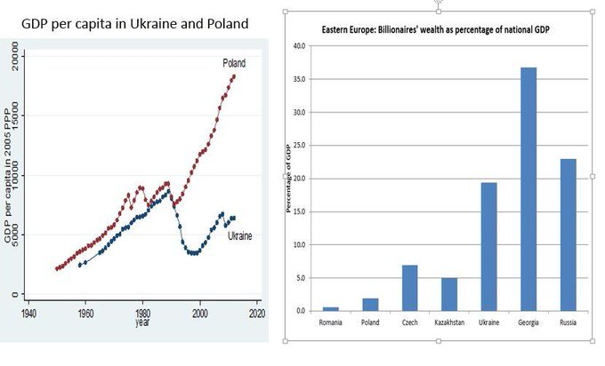

status: published
date: 2022-01-24
title: 

# Monday 24, January 2022

We hear about Ukraine as a land bridge to run gas pipes through and a frontline between Russia and NATO.
The reality is that it's a desperately poor country, as a consequence of all manufacturing industry being cartelized by 
a handful of oligarchs who date back to Soviet times.
Left-wing leaders in the developed world complain about modest levels of inequality at home (at least relative to communist and former communist countries) but never want to criticize the totally evil leaders like Putin and Xi.

This isn't just a matter of politics. Having a country crippled economically by a kleptocracy results in a loss of life as sure as dropping chemical weapons does. If we want to take humanitarian action, we should at least keep these monsters outside of the UK.

A recent report by the National Crime Agency estimated that the UK lost £100B as a result of money laundering.
If we arrested some of these crooks, rather than selling them homes in Chelsea, we'd be a lot better off, and so would their currently impoverished compatriots.

 
## Wrap

Equities dived and then recovered today, as the trading day closed.
ES up 0.38%. 
This was a remarkable turnaround from a decline at one point of more than 4%.
Bonds were flat.
Commodities were generally down. Maybe they'll catch up with equities tomorrow, or equities will retrace.
The dollar was up, hurting commodities, and emphasizing that this was a risk-on day in spite of the 
last minute rally in equities.

It seems that the driver is an increasing consensus that the Fed will announce a hike in a meeting this week.

$ARKK type stocks are well down on their highs.
Some sanity is returning to the market, but clearly a lot of this rubbish is not going to survive.
It would be mad to short this market seriously, but it's hard to believe that it'll return to trend any time soon.

I happen to think that $CHWY, which is basically in the business of selling pet food over the internet, shouldn't have a 
market cap of $18B, when it can't turn a profit and has a price to book in the high 200s.
However, it went up 14% today, so go figure!

